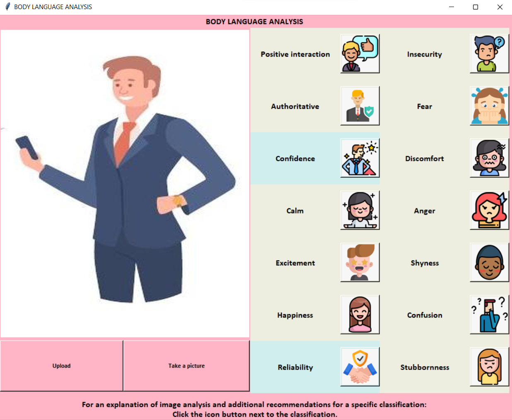
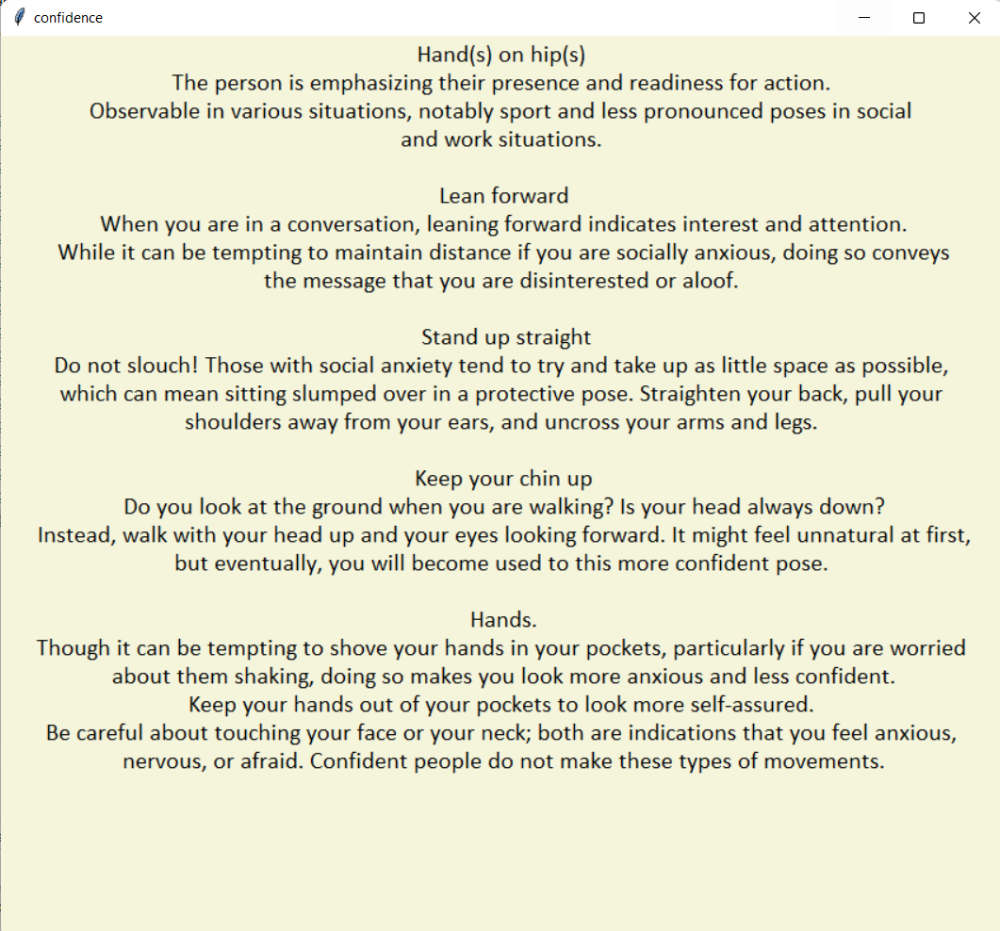

# Body-Language-Analysis
A system that analyzes and provides recommendations for better Body Language by CV &amp; ML technologies.

The GUI:
Convenient, Clear, User-friendly.

With two options: Upload / Take a photo

Contains a list of the meanings of body language with an icon button.

After receiving a classification on the image,
If you click on it you will receive an explanation of the analysis and Recommendations for this classification.

 
